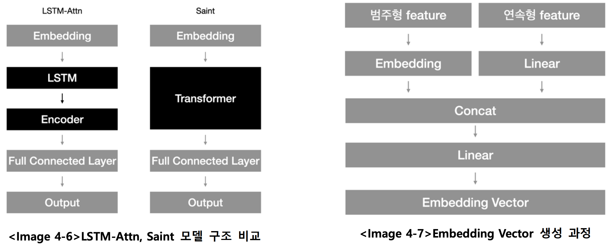

# RecSys16(사분의 오) DKT 프로젝트 저장소

## 프로젝트 소개
### 개요
프로젝트는 주어진 Iscream Edu Dataset의 유저별 마지막 문제의 정오 유무를 예측하는 것이다. Dataset은 Train set과 Test
set으로 구성되어 있으며, 약 226만 개의 데이터가 사용자를 기준으로 90/10의 비율로 나누어져 있다. Dataset의 메인 정
보로는 7,442 명의 사용자(userID)와 9,454개의 고유 문항(assessment ID)의 정오 유무(answerCode)가 있으며, feature
engineering에 활용될 수 있는 부가 정보로는 3가지로 timestamp(문제를 풀기 시작한 시각), knowledgeTag(고유 태그 번
호), TestID(시험지 번호)로 구성되어 있다.

### 사용 모델
#### [LGBM](https://lightgbm.readthedocs.io/en/latest/)
GBM(Gradient Boosting Machine) 프레임워크로 Tree 기반 학습 알고리즘이며 Kaggle 데이터 분석대회에서 많은 우승을
하였다. 이번 대회는 많은 feature 들을 만들고 이러한 feature가 문제풀이에 유의미한 영향을 주는지 파악하
는 것이 중요하다고 생각하여, LGBM 이 제공하는 feature_importance라는 기능을 사용하고자 LGBM을 학습해보았다. 하지
만, 하나의 새로운 feature 가 들어가면 이전까지의 실험으로 중요하다고 여겨졌던 feature의 중요도가 갑자기 낮아지는
것을 확인한 뒤에 이 방법으로는 feature들의 중요도를 일관적으로 확인할 수 없겠다고 판단하였다.
#### [Tabnet](https://github.com/dreamquark-ai/tabnet)
categorical & numeric data를 input으로 하는 End to End 딥러닝 모델인 Tabnet을 이용해 다양한 실험을 진행했다.
["KnowledgeTag", 'assessmentItemID' , "class", "elapsed", "momentum", "user_acc", ‘class_acc']의 총 7개 column을 활용하고
cat_dim=256, mask_type=entmax로 지정했을 때 최종 성적 기준 가장 좋은 성능을 보였는데, validation과 LB 성적 간에 차이
가 있어 최종 제출로 선택하지 못했다. Test data가 총 744개의 row를 가지는 만큼 CV 전략이 중요했던 것 같은데 이를 제
대로 구현하지 못해 아쉬움이 남는다.
#### [UltraGCN](https://github.com/xue-pai/UltraGCN)
UltraGCN의 속도는 LightGCN에 비해 빠르고 성능이 좋다고 알려져 있어, 문제 제작자의 의도대로 UltraGCN 모델을 <참
고 자료 1>을 활용하여 만들었다. 모델에서 1은 그래프를 연결한 것이고, 0은 그래프를 연결하지 않은 것을 의미하였다.
따라서, negative sampling이 기존에는 random하게 추출하는 것이었지만, 현재 상황에서 negative한 정보는 answerCode가
0인 경우이므로 negative sampling을 answerCode가 0인 부분에서 추출하는 것으로 변경한 결과 성능 향상을 이루었다.
#### Bert
베이스라인의 Bert 모델에 Ultragcn을 통해 학습시킨 user와 item embedding을 추가해 학습을 진행하고, pseudo labeling
을 적용한 test data만을 활용해 3epoch의 추가 학습을 시도했다. 양방향 학습을 하는 Bert 외에 단방향 학습을 하는
transformer를 활용하는 시도를 추가로 했다면 좋았을 것 같다
#### LSTM-attention 및 Saint
기존에 baseline에 있는 LSTM-Attn은 LSTM을 사용한 RNN 구조 이후에 transformer의 encoder 구조만을 사용하지만,
Saint는 transformer로 정답률을 예측하는 모델이다<Image 4-6>. 두 모델 모두 embedding vector를 생성하는 과정은 동
일했다. 범주형 feature들은 각각의 embedding 과정을 거치고, 연속형 feature들은 Linear 연산 이후에 하나의 vector로
합친 이후에 hidden dimension으로 변환시키는 Linear 연산을 실행했다<Image 4-7>. 두 모델을 실험해본 결과 LSTM-
Attn이 더 좋은 성능을 보여주었다(LSTM-Attn: 0.7601, Saint: 0.7400). 데이터의 개수가 부족해 transformer 구조로는 학습
이 제대로 되지 않아 생긴 현상이라고 생각된다.

## 팀원
|  |  |  |  |
|:----------------------------------------------------------------------------------------------:|:----------------------------------------------------------------------------------------------:|:-------------------------------------------------------------------------------------------------:|:---------------------------------------------------------------------------------------------:|
|                             [ 구창회 ](https://github.com/sonyak-ku)                              |                             [ 김지원 ](https://github.com/Jiwon1729)                              |                              [ 전민규 ](https://github.com/alsrb0607)                             |                              [ 정준우 ](https://github.com/ler0n)                             |
|                                              

## 최종 순위 및 결과

|리더보드| auroc  |     순위     |
|:--------:|:------:|:----------:|
|public| 0.8186 |  **11등**   |
|private| 0.8214 | **최종 12등** |

